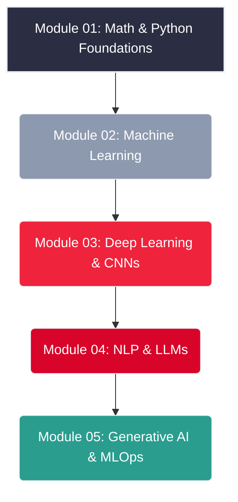

# 🤖 AI Masterclass: From Scratch to Advanced 🚀


Welcome to the ultimate, comprehensive learning path for Artificial Intelligence. This repository is curated and maintained by **Charith Gunarathna** ([@charithgunarathna](https://github.com/charithgunarathna)), designed to take you from a complete beginner with zero knowledge to an advanced AI practitioner capable of deploying real-world models.


---

## 🗺️ The AI Learning Roadmap

Follow this structured path chronologically for the best learning experience. 



---

## 📚 Course Curriculum

Navigate through the folders below to access the deep-dive materials, notes, and resources for each phase of the masterclass:

* 🏛️ **[`01-Mathematical-Foundations`](./01-Mathematical-Foundations)**: Linear Algebra, Calculus, Statistics, and Python data science libraries (NumPy, Pandas, Matplotlib).
* 🌐 **[`02-Machine-Learning`](./02-Machine-Learning)**: Supervised/Unsupervised Learning, Regression, Classification, and Tree-Based Models.
* 🕸️ **[`03-Deep-Learning`](./03-Deep-Learning)**: Neural Networks, Activation Functions, Convolutional Neural Networks (CNNs) for image recognition, and Optimizers.
* ✍️ **[`04-NLP-and-LLMs`](./04-NLP-and-LLMs)**: Natural Language Processing, Word Embeddings, Transformer Architecture, and Large Language Models (ChatGPT, Gemini).
* 🎨 **[`05-Generative-AI-Deployment`](./05-Generative-AI-Deployment)**: Generative Adversarial Networks (GANs), Diffusion Models, RAG, and deploying models to production (MLOps).

---

## ⚙️ Prerequisites

While this guide starts from the very beginning, to succeed you should have:
* A basic understanding of computers and programming logic.
* High curiosity and a passion for problem-solving.
* Dedication to practice writing code.

---

## 🛠️ Your AI Lab Setup

Set up your local or cloud environment for smooth learning. We primarily use Python and Jupyter Notebooks.

| Tool | Purpose | Download Link |
| :--- | :--- | :--- |
| **Python 3.x** | The primary programming language for AI. | [Download Here](https://www.python.org/downloads/) |
| **Google Colab** | Free, powerful Jupyter Notebook environment with Cloud GPU support. | [Start Here](https://colab.research.google.com/) |
| **Visual Studio Code** | Standard IDE for coding and local development. | [Download Here](https://code.visualstudio.com/) |
| **Kaggle** | Platform for finding datasets and practicing ML projects. | [Start Here](https://www.kaggle.com/) |

---

## 🚀 How to Use This Repository

1.  **Star the Repo**: Click the ⭐ button at the top right to bookmark this learning path.
2.  **Clone the Repo**: Download the files to your local machine using:
    ```bash
    git clone [https://github.com/charithgunarathna/YourRepositoryName.git](https://github.com/charithgunarathna/YourRepositoryName.git)
    ```
3.  **Follow Chronologically**: Start from Module 01 and read the `README.md` in each folder. 

---

## ⚠️ Disclaimer & Contribution

> **DISCLAIMER:** The resources and examples provided here are for **educational purposes only**. Charith Gunarathna assumes no responsibility or liability for any misuse of the information shared. Always respect data privacy and avoid harmful applications of AI.

⭐ **If this repository has helped your AI journey, please don't forget to give it a Star!** ⭐

---
👨‍💻 **Maintainer:** **Charith Gunarathna** ([@charithgunarathna](https://github.com/charithgunarathna))  
🎉 **Happy Learning & Building!**
